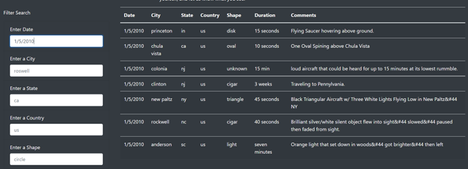

# UFOs
Use basic HTML, Bootstrap, and CSS along with JavaScript to build and style a webpage.
## Overview
Dana is a journalist who has been given an opportunity to write about whatever she wants, and she chooses to uses to focus on UFO sightings in her hometown. Within the module, we helped her use JavaScript to display data of UFO sightings (given to her as a Javascript file) as a table using multiple filters and create a clean HTML page to help her post her article online, along with the table of data that can be filtered to help fine-tune her results. We have created filters to make this table fully dynamic, meaning that it will react to user input, and then place the table into an HTML file for easy viewing. 
### Purpose
The purpose of this challenge is to provide a more in-depth analysis of UFO sightings by allowing users to filter for multiple criteria at the same time. In addition to the date, users will be able to add table filters for the city, state, country, and shape. 

## Results
Using JavaScript and HTML we have created an interactive webpage that allows the reader to filter the data around UFO sightings. As we can see in Fig.1 below, the main webpage allows the user to filter data based on: 
- Date 
- City 
- State 
- Country
- Shape 
#### Main Page
##### Fig.1

Below, you can preview an example of how to filter the data on our UFO Sightings webpage to find information about UFO sightings of unknown shape that occurred on 1/5/2010 in New Jersey.

#### Filter by Date
In order to filter the data for the desired date, the user will enter a date in the "Enter Date" box as shown in Fig.2 below. In this example, I have filtered the data for UFO sightings on 1/5/2010. After pressing the Enter key, the table is updated accordingly, and we can see that there were seven sightings that occurred on 1/5/2010. 
##### Fig.2

#### Filter by State
In order to narrow down the search, users can "Enter a State". As we can see in Fig.3 below, I have filtered for NJ, showing the updated table with two sightings in New Jersey on 1/5/2010.
##### Fig.3

#### Filter by Shape
To continue our search, I have narrowed down the data to filter for Shape as unknown. As we can see in Fig. 4 below, we can see that one sighting occurred on 1/5/2010 in the State of New Jersey, with a shape that is unknown.
##### Fig. 4

#### Reset Webpage
Once the user has found the specific data they are looking for, they can reset the webpage to begin a new search. As shown in Fig.5, the user will press the navigator bar (UFO Sightings) on the top of the page to reset the filters.
##### Fig.5

## Summary
One drawback of this new design for our website is that users may not necessarily know how to refresh the page. One way to address this is by including a button to clear all filters at the bottom of the page (below the Enter a Shape) filter for easy access. Another way to further develop this design is by allowing users to clear specific filters without clearing all of the data. This can be done by including a button after each filter value so users can search for different criteria based on their needs. For example, if a user filters for data for UFO sightins with a circle shape on 1/1/2010 in California and gets no results, they can simply clear the Enter a Shape filter and search for triangle shape UFO sightings on 1/1/2010 in California instead. 
